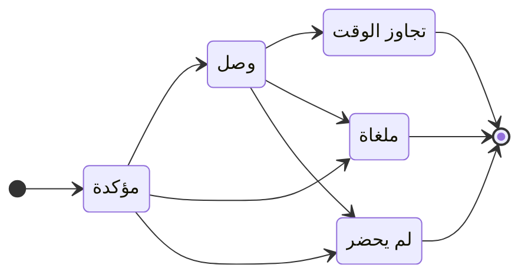

import { Steps, Callout } from 'nextra/components'

# الحجوزات والطاولات

أدِر مخطط صالتك، اقبل أو ارفض طلبات الطاولات، وتابع الإشغال في الوقت الفعلي من لوحة تحكم موحدة.

## الأساسيات

تتيح لك وحدة الحجوزات عرض مخطط صالتك، وإدارة الطاولات وفتراتها الزمنية، وقبول أو رفض كل طلب. تتابع حالة كل خدمة في الوقت الفعلي (مؤكدة، وصل، منتهية) وتتوقع حركة الإقبال بفضل العرض اليومي.

## كيف تعمل

يركز Grubano جميع حجوزاتك على شاشة واحدة: تنشئ طاولات صالتك، تحدد سعتها (عدد المقاعد)، ثم تستقبل الطلبات — سواء جاءت من عميل متصل أو من إدخال يدوي. تمر كل حجز بدورة حياة بسيطة: **مؤكدة** منذ إنشائها، **وصل** عندما تستقبل العميل، ثم **ملغاة** أو **لم يحضر** حسب الحالة. يتحقق النظام تلقائياً من توفر الفترة الزمنية (لا يوجد تداخل على نفس الطاولة) وينبهك إذا كان الطلب يقع خارج ساعات العمل — القرار النهائي لك.

تعرض شاشة الحجوزات جميع طاولات منشأتك الحالية؛ إذا كنت تدير عدة منشآت (امتياز)، فلكل نقطة بيع مخططها وفتراتها الزمنية الخاصة. تجمع [لوحة التحكم](/ar/guides/restaurant/) الحجوزات النشطة لليوم، مع الوصولات القادمة في أعلى القائمة.

## خطوة بخطوة

<Steps>

### أنشئ مخطط صالتك

انتقل إلى **الحجوزات** وأضف كل طاولة: اعطها اسماً ("طاولة 1"، "التراس 4")، حدد عدد المقاعد، وضعها على المخطط المرئي. تظهر الطاولة النشطة فوراً متاحة للحجز.

### استقبل طلباً

يطلب عميل طاولة لتاريخ وساعة وعدد من المقاعد. يتحقق النظام من أن الطاولة المختارة لديها مقاعد كافية وأنه لا يوجد حجز آخر يشغل الفترة الزمنية؛ إذا كان كل شيء متاحاً، يُنشأ الحجز بحالة **مؤكدة**.

<Callout type="warning">
إذا كانت الفترة الزمنية تقع خارج ساعات العمل المحددة أو خلال إغلاق استثنائي، يظهر تحذير — يمكنك مع ذلك تأكيد الحجز (مناسبة خاصة، خدمة خاصة).
</Callout>

### تأكيد الوصول

عندما يحضر العميل، ضع علامة على الحجز **وصل**. يُفتح حساب تلقائياً على الطاولة، جاهز لاستقبال الطلبات. إذا كان هناك حساب قديم غير مدفوع لا يزال موجوداً على هذه الطاولة، ينبهك النظام — سوِّ أو ألغِ الحساب القديم قبل استقبال الخدمة الجديدة.

### إدارة الغيابات والإلغاءات

يمكن **إلغاء** الحجز (من قِبلك أو من قِبل العميل) أو وضع علامة **لم يحضر** إذا لم يحضر الشخص. في الحالتين، تعود الطاولة متاحة للفترة الزمنية. يمكن لـ Grubano إرسال بريد إلكتروني للعميل لإبلاغه بالإلغاء من جانب المطعم (يُستخدم عنوان البريد الإلكتروني للعميل أو عنوان حسابه).

</Steps>

## أفضل الممارسات

- **حدد مدة افتراضية**: يمكن لكل منشأة تحديد مدة خدمة متوسطة (60 أو 90 أو 120 دقيقة)؛ يحسب النظام تلقائياً نهاية الفترة الزمنية لتجنب التداخلات.
- **احجب الفترات الماضية**: يرفض الخادم أي حجز يكون وقت بدايته قد مضى بالفعل (مع هامش تسامح 5 دقائق لاستيعاب فارق الساعة).
- **تحقق من السعة**: طاولة من 4 مقاعد لا يمكنها استيعاب حجز لـ 6 مقاعد — يحجب النظام الطلب ويطلب منك اختيار طاولة أكبر أو دمج عدة طاولات.
- **راقب الإشغال في الوقت الفعلي**: تعرض لوحة التحكم عدد الخدمات النشطة والوصولات القادمة، مما يتيح لك توقع أوقات الذروة.

## مثال عملي

يحتوي مطعمك على 3 طاولات (مقعدان، 4 مقاعد، 6 مقاعد). يحجز عميل طاولة الـ 4 مقاعد ليوم السبت من الساعة 20:00–22:00: يتحقق النظام من عدم وجود حجز آخر يشغل هذه الفترة الزمنية، يؤكد الطلب، ويضيفه إلى الجدول. مساء السبت، يصل العميل في الساعة 20:05: تضع علامة على الحجز بحالة **وصل**، يُفتح حساب تلقائياً على الطاولة 4، وتأخذ الطلب. في الساعة 22:15، تنتهي الخدمة، يُسدد الحساب: تعود الطاولة متاحة لخدمة ثانية محتملة.

## للمزيد

- [لوحة تحكم المطعم](/ar/guides/restaurant/) — نظرة عامة على الحجوزات النشطة والوصولات القادمة لليوم.
