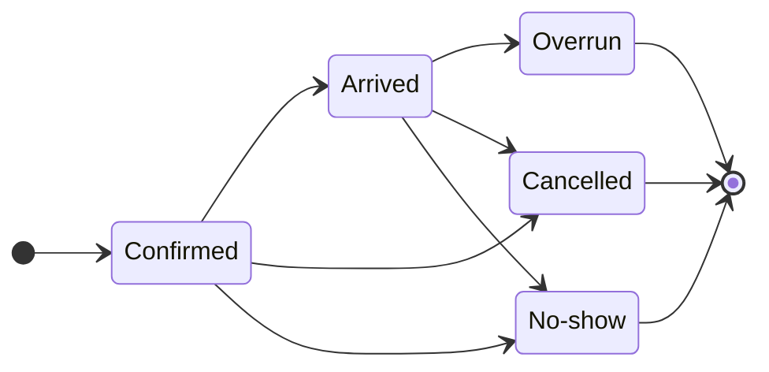

import { Steps, Callout } from 'nextra/components'

# Reservations & Dine-In

Manage your floor plan, accept or decline table requests, and track occupancy in real time from a unified dashboard.

## The Essentials

The Reservations module lets you visualize your floor plan, manage tables and their time slots, and accept or decline each request. You track the status of each service in real time (confirmed, arrived, completed) and anticipate traffic thanks to a daily view.

## How It Works

Grubano centralizes your reservations on a single screen: you create the tables in your dining area, define their capacity (number of covers), then receive requests—whether from a logged-in customer or a manual entry. Each reservation goes through a simple lifecycle: **confirmed** upon creation, **arrived** when you welcome the guest, then **cancelled** or **no-show** depending on the case. The system automatically verifies time slot availability (no overlap on the same table) and alerts you if the request falls outside your opening hours—you have the final say.

The Reservations screen displays all the tables for your current establishment; if you operate multiple locations (franchise), each point of sale has its own floor plan and time slots. The [dashboard](/en/guides/restaurant/) groups the day’s active reservations, with upcoming arrivals at the top of the list.

## Step by Step

<Steps>

### Create Your Floor Plan

Go to **Reservations** and add each table: assign it a name ("Table 1," "Patio 4"), indicate the number of seats, and place it on the visual plan. An active table immediately becomes available for reservation.

### Receive a Request

A customer requests a table for a date, time, and number of covers. The system verifies that the chosen table has enough seats and that no other reservation occupies the time slot; if everything is free, the reservation is created with a **confirmed** status.

<Callout type="warning">
If the time slot falls outside your configured hours or during an exceptional closure, a warning appears—you can still confirm the reservation (private event, special service).
</Callout>

### Validate Arrival

When the customer arrives, mark the reservation as **arrived**. A bill is automatically opened on the table, ready to receive orders. If an old unpaid bill still exists on that table, the system alerts you—settle or cancel the old bill before welcoming the new service.

### Handle Absences and Cancellations

A reservation can be **cancelled** (by you or by the customer) or marked as a **no-show** if the person doesn’t come. In both cases, the table becomes free again for the time slot. Grubano can send an email to the customer to inform them of the restaurant-side cancellation (the customer’s email address or their account email is used).

</Steps>

## Best Practices

- **Set a default duration**: each establishment can set an average service duration (60, 90, or 120 minutes); the system automatically calculates the end of the time slot to avoid overlaps.
- **Block past time slots**: the server refuses any reservation whose start time has already passed (with a 5-minute tolerance to absorb clock drift).
- **Verify capacity**: a 4-seat table cannot accommodate a 6-cover reservation—the system blocks the request and asks you to choose a larger table or combine multiple tables.
- **Monitor occupancy in real time**: the dashboard displays the number of active services and upcoming arrivals, allowing you to anticipate busy periods.

## Concrete Example

Your restaurant has 3 tables (2 seats, 4 seats, 6 seats). A customer reserves the 4-seat table for Saturday 8:00 PM–10:00 PM: the system verifies that no other reservation occupies that time slot, confirms the request, and adds it to the schedule. Saturday evening, the customer arrives at 8:05 PM: you change the reservation to **arrived** status, a bill automatically opens on table 4, and you take the order. At 10:15 PM, service is complete, the bill is paid: the table becomes free again for a potential second seating.

## Going Further

- [Restaurant Dashboard](/en/guides/restaurant/) — overview of active reservations and the day’s upcoming arrivals.
