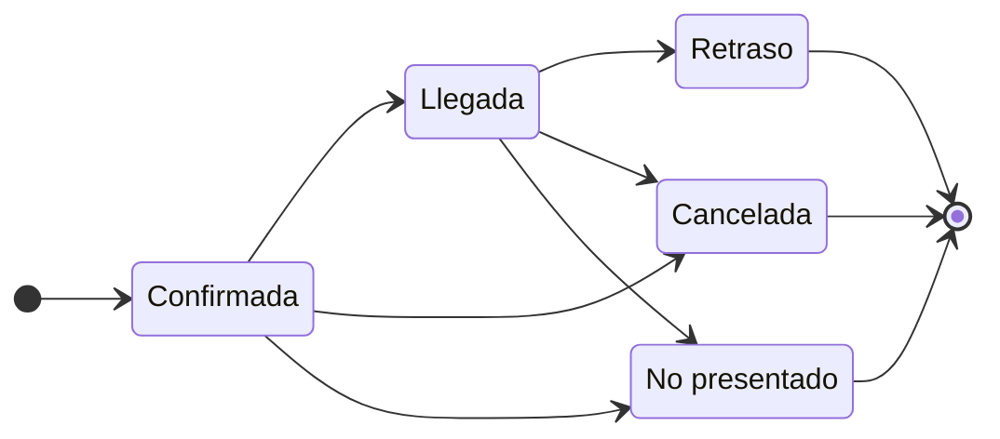

import { Steps, Callout } from 'nextra/components'

# Reservas y presencial

Gestione su plano de sala, acepte o rechace las solicitudes de mesa, y siga la ocupación en tiempo real desde un panel unificado.

## Lo esencial

El módulo Reservas le permite visualizar su plano de sala, gestionar las mesas y sus turnos, y aceptar o rechazar cada solicitud. Sigue el estado de cada servicio en tiempo real (confirmada, llegada, finalizada) y anticipa la afluencia gracias a una vista diaria.

## Cómo funciona

Grubano centraliza sus reservas en una sola pantalla: crea las mesas de su sala, define su capacidad (número de cubiertos), y luego recibe las solicitudes — tanto si provienen de un cliente conectado como de una toma manual. Cada reserva pasa por un ciclo de vida sencillo: **confirmada** desde su creación, **llegada** cuando acoge al cliente, y luego **cancelada** o **no presentado** según el caso. El sistema verifica automáticamente la disponibilidad del turno (ningún solapamiento en la misma mesa) y le alerta si la solicitud cae fuera de sus horarios de apertura — usted tiene la última palabra.

La pantalla Reservas muestra todas las mesas de su establecimiento actual; si gestiona varios establecimientos (franquicia), cada punto de venta tiene su propio plano y sus propios turnos. El [panel de control](/es/guides/restaurant/) agrupa las reservas activas del día, con las próximas llegadas en la parte superior de la lista.

## Paso a paso

<Steps>

### Cree su plano de sala

Diríjase a **Reservas** y añada cada mesa: asígnele un nombre ("Mesa 1", "Terraza 4"), indique el número de plazas sentadas, y colóquela en el plano visual. Una mesa activa aparece inmediatamente disponible para reserva.

### Reciba una solicitud

Un cliente solicita una mesa para una fecha, una hora y un número de cubiertos. El sistema verifica que la mesa elegida tiene suficientes plazas y que ninguna otra reserva ocupa el turno; si todo está libre, la reserva se crea con el estado **confirmada**.

<Callout type="warning">
Si el turno cae fuera de sus horarios configurados o durante un cierre excepcional, se muestra una advertencia — puede confirmar la reserva de todas formas (evento privado, servicio especial).
</Callout>

### Valide la llegada

Cuando el cliente se presenta, marque la reserva como **llegada**. Se abre automáticamente una cuenta en la mesa, lista para recibir los pedidos. Si aún subsiste una antigua cuenta impagada en esta mesa, el sistema le avisa — regularice o cancele la antigua nota antes de acoger el nuevo servicio.

### Gestione las ausencias y cancelaciones

Una reserva puede ser **cancelada** (por usted o por el cliente) o marcada como **no presentado** si la persona no acude. En ambos casos, la mesa vuelve a estar libre para el turno. Grubano puede enviar un correo electrónico al cliente para informarle de la cancelación por parte del restaurante (se utiliza la dirección de correo electrónico del cliente o la de su cuenta).

</Steps>

## Buenas prácticas

- **Defina una duración por defecto**: cada establecimiento puede fijar una duración media de servicio (60, 90 o 120 minutos); el sistema calcula automáticamente el fin del turno para evitar solapamientos.
- **Bloquee los turnos pasados**: el servidor rechaza cualquier reserva cuya hora de inicio ya haya transcurrido (con una tolerancia de 5 minutos para absorber el desfase del reloj).
- **Verifique la capacidad**: una mesa de 4 plazas no puede acoger una reserva de 6 cubiertos — el sistema bloquea la solicitud y le pide elegir una mesa más grande o combinar varias mesas.
- **Vigile la ocupación en tiempo real**: el panel de control muestra el número de servicios activos y las próximas llegadas, permitiéndole anticipar los momentos de máxima afluencia.

## Ejemplo concreto

Su restaurante dispone de 3 mesas (2 plazas, 4 plazas, 6 plazas). Un cliente reserva la mesa de 4 para el sábado de 20h a 22h: el sistema verifica que ninguna otra reserva ocupa ese turno, confirma la solicitud y la añade a la planificación. El sábado por la noche, el cliente llega a las 20h05: cambia la reserva al estado **llegada**, se abre automáticamente una cuenta en la mesa 4, y toma el pedido. A las 22h15, el servicio ha finalizado, la cuenta está pagada: la mesa vuelve a estar libre para un eventual segundo servicio.

## Para ir más allá

- [Panel de control restaurante](/es/guides/restaurant/) — vista general de las reservas activas y las próximas llegadas del día.
