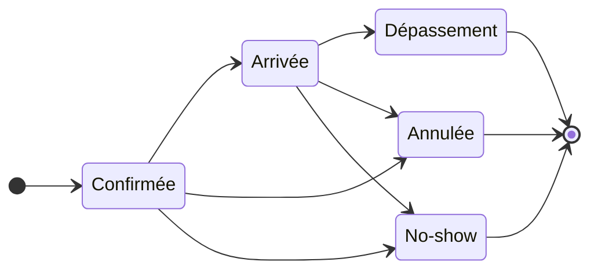

import { Steps, Callout } from 'nextra/components'

# Réservations & sur place

Gérez votre plan de salle, acceptez ou refusez les demandes de table, et suivez l’occupation en temps réel depuis un tableau de bord unifié.

## L’essentiel

Le module Réservations vous permet de visualiser votre plan de salle, de gérer les tables et leurs créneaux, et d’accepter ou refuser chaque demande. Vous suivez l’état de chaque service en temps réel (confirmée, arrivée, terminée) et anticipez l’affluence grâce à une vue quotidienne.

## Comment ça marche

Grubano centralise vos réservations sur un seul écran : vous créez les tables de votre salle, définissez leur capacité (nombre de couverts), puis recevez les demandes — qu’elles viennent d’un client connecté ou d’une prise manuelle. Chaque réservation passe par un cycle de vie simple : **confirmée** dès sa création, **arrivée** quand vous accueillez le client, puis **annulée** ou **no-show** selon le cas. Le système vérifie automatiquement la disponibilité du créneau (aucun chevauchement sur la même table) et vous alerte si la demande tombe en dehors de vos horaires d’ouverture — vous gardez le dernier mot.

L’écran Réservations affiche toutes les tables de votre établissement courant ; si vous exploitez plusieurs établissements (franchise), chaque point de vente a son propre plan et ses propres créneaux. Le [tableau de bord](/fr/guides/restaurant/) regroupe les réservations actives de la journée, avec les prochaines arrivées en haut de liste.

## Étape par étape

<Steps>

### Créez votre plan de salle

Rendez-vous dans **Réservations** et ajoutez chaque table : attribuez-lui un nom (« Table 1 », « Terrasse 4 »), indiquez le nombre de places assises, et placez-la sur le plan visuel. Une table active apparaît immédiatement disponible à la réservation.

### Recevez une demande

Un client demande une table pour une date, une heure et un nombre de couverts. Le système vérifie que la table choisie a suffisamment de places et qu’aucune autre réservation n’occupe le créneau ; si tout est libre, la réservation est créée au statut **confirmée**.

<Callout type="warning">
Si le créneau tombe en dehors de vos horaires configurés ou pendant une fermeture exceptionnelle, un avertissement s’affiche — vous pouvez tout de même confirmer la réservation (événement privé, service spécial).
</Callout>

### Validez l’arrivée

Quand le client se présente, marquez la réservation **arrivée**. Une addition est automatiquement ouverte sur la table, prête à recevoir les commandes. Si une ancienne addition impayée subsiste encore sur cette table, le système vous en avertit — réglez ou annulez l’ancienne note avant d’accueillir le nouveau service.

### Gérez les absences et annulations

Une réservation peut être **annulée** (par vous ou par le client) ou marquée **no-show** si la personne ne vient pas. Dans les deux cas, la table redevient libre pour le créneau. Grubano peut envoyer un e-mail au client pour l’informer de l’annulation côté restaurant (l’adresse e-mail du client ou celle de son compte est utilisée).

</Steps>

## Bonnes pratiques

- **Définissez une durée par défaut** : chaque établissement peut fixer une durée moyenne de service (60, 90 ou 120 minutes) ; le système calcule automatiquement la fin du créneau pour éviter les chevauchements.
- **Bloquez les créneaux passés** : le serveur refuse toute réservation dont l’heure de début est déjà écoulée (avec une tolérance de 5 minutes pour absorber le décalage d’horloge).
- **Vérifiez la capacité** : une table de 4 places ne peut accueillir une réservation de 6 couverts — le système bloque la demande et vous demande de choisir une table plus grande ou de combiner plusieurs tables.
- **Surveillez l’occupation en temps réel** : le tableau de bord affiche le nombre de services actifs et les prochaines arrivées, vous permettant d’anticiper les coups de feu.

## Exemple concret

Votre restaurant dispose de 3 tables (2 places, 4 places, 6 places). Un client réserve la table de 4 pour samedi 20h–22h : le système vérifie qu’aucune autre réservation n’occupe ce créneau, confirme la demande, et l’ajoute au planning. Samedi soir, le client arrive à 20h05 : vous passez la réservation en statut **arrivée**, une addition s’ouvre automatiquement sur la table 4, et vous prenez la commande. À 22h15, le service est terminé, l’addition réglée : la table redevient libre pour un éventuel deuxième service.

## Pour aller plus loin

- [Tableau de bord restaurant](/fr/guides/restaurant/) — vue d’ensemble des réservations actives et des prochaines arrivées du jour.
