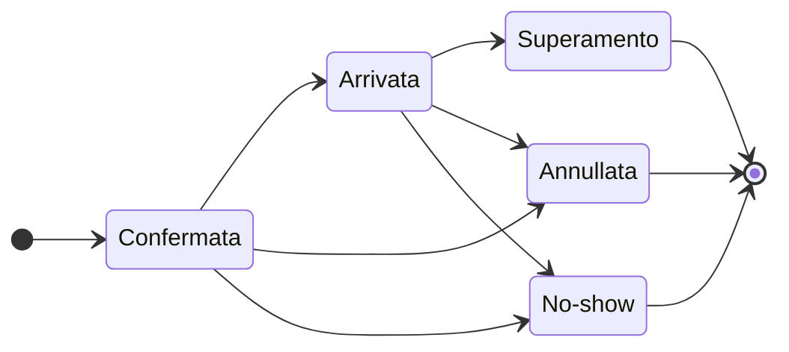

import { Steps, Callout } from 'nextra/components'

# Prenotazioni & sul posto

Gestisca la planimetria della sua sala, accetti o rifiuti le richieste di tavolo, e segua l’occupazione in tempo reale da un cruscotto unificato.

## L’essenziale

Il modulo Prenotazioni le permette di visualizzare la planimetria della sua sala, di gestire i tavoli e le loro fasce orarie, e di accettare o rifiutare ogni richiesta. Segua lo stato di ogni servizio in tempo reale (confermata, arrivata, terminata) e anticipi l’affluenza grazie a una vista giornaliera.

## Come funziona

Grubano centralizza le sue prenotazioni su un’unica schermata: crei i tavoli della sua sala, definisca la loro capacità (numero di coperti), poi riceva le richieste — che provengano da un cliente connesso o da una presa manuale. Ogni prenotazione passa attraverso un ciclo di vita semplice: **confermata** dalla sua creazione, **arrivata** quando accoglie il cliente, poi **annullata** o **no-show** secondo il caso. Il sistema verifica automaticamente la disponibilità della fascia oraria (nessuna sovrapposizione sullo stesso tavolo) e la avverte se la richiesta cade al di fuori dei suoi orari di apertura — lei mantiene l’ultima parola.

La schermata Prenotazioni visualizza tutti i tavoli del suo esercizio corrente; se gestisce più esercizi (franchising), ogni punto vendita ha la propria planimetria e le proprie fasce orarie. Il [cruscotto](/it/guides/restaurant/) raggruppa le prenotazioni attive della giornata, con i prossimi arrivi in cima alla lista.

## Passo dopo passo

<Steps>

### Crei la planimetria della sua sala

Si rechi in **Prenotazioni** e aggiunga ogni tavolo: gli attribuisca un nome ("Tavolo 1", "Terrazza 4"), indichi il numero di posti a sedere, e lo posizioni sulla planimetria visuale. Un tavolo attivo appare immediatamente disponibile per la prenotazione.

### Riceva una richiesta

Un cliente richiede un tavolo per una data, un orario e un numero di coperti. Il sistema verifica che il tavolo scelto abbia abbastanza posti e che nessun’altra prenotazione occupi la fascia oraria; se tutto è libero, la prenotazione viene creata con lo stato **confermata**.

<Callout type="warning">
Se la fascia oraria cade al di fuori dei suoi orari configurati o durante una chiusura eccezionale, viene visualizzato un avviso — può comunque confermare la prenotazione (evento privato, servizio speciale).
</Callout>

### Convalidi l’arrivo

Quando il cliente si presenta, contrassegni la prenotazione come **arrivata**. Un conto viene automaticamente aperto sul tavolo, pronto a ricevere le comande. Se un vecchio conto non pagato sussiste ancora su questo tavolo, il sistema la avverte — regoli o annulli il vecchio conto prima di accogliere il nuovo servizio.

### Gestisca le assenze e cancellazioni

Una prenotazione può essere **annullata** (da lei o dal cliente) o contrassegnata come **no-show** se la persona non si presenta. In entrambi i casi, il tavolo diventa nuovamente libero per la fascia oraria. Grubano può inviare un’e-mail al cliente per informarlo della cancellazione da parte del ristorante (viene utilizzato l’indirizzo e-mail del cliente o quello del suo account).

</Steps>

## Buone pratiche

- **Definisca una durata predefinita**: ogni esercizio può fissare una durata media di servizio (60, 90 o 120 minuti); il sistema calcola automaticamente la fine della fascia oraria per evitare sovrapposizioni.
- **Blocchi le fasce orarie passate**: il server rifiuta qualsiasi prenotazione il cui orario di inizio sia già trascorso (con una tolleranza di 5 minuti per assorbire lo sfasamento dell’orologio).
- **Verifichi la capacità**: un tavolo da 4 posti non può accogliere una prenotazione di 6 coperti — il sistema blocca la richiesta e le chiede di scegliere un tavolo più grande o di combinare più tavoli.
- **Sorvegli l’occupazione in tempo reale**: il cruscotto visualizza il numero di servizi attivi e i prossimi arrivi, permettendole di anticipare i momenti di punta.

## Esempio concreto

Il suo ristorante dispone di 3 tavoli (2 posti, 4 posti, 6 posti). Un cliente prenota il tavolo da 4 per sabato ore 20–22: il sistema verifica che nessun’altra prenotazione occupi questa fascia oraria, conferma la richiesta, e l’aggiunge al planning. Sabato sera, il cliente arriva alle 20:05: lei passa la prenotazione allo stato **arrivata**, un conto si apre automaticamente sul tavolo 4, e prende la comanda. Alle 22:15, il servizio è terminato, il conto regolato: il tavolo diventa nuovamente libero per un eventuale secondo servizio.

## Per andare oltre

- [Cruscotto ristorante](/it/guides/restaurant/) — vista d’insieme delle prenotazioni attive e dei prossimi arrivi del giorno.
